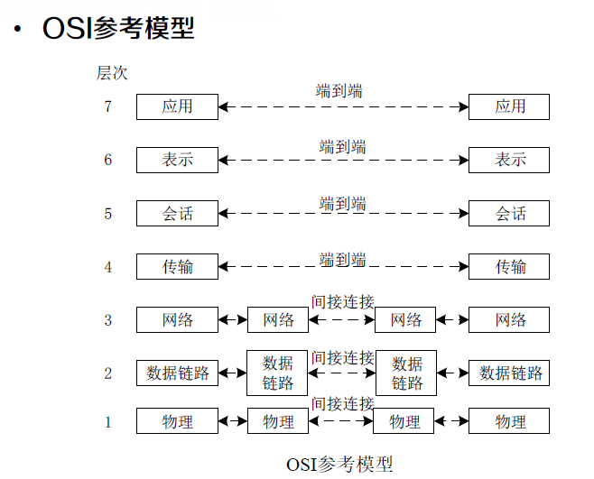
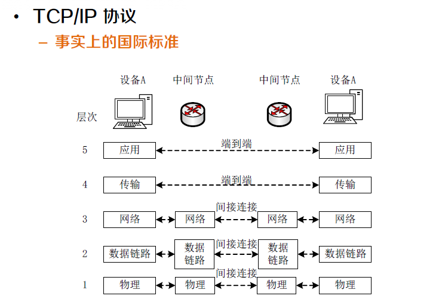
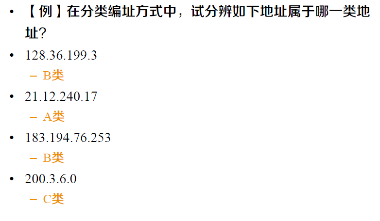
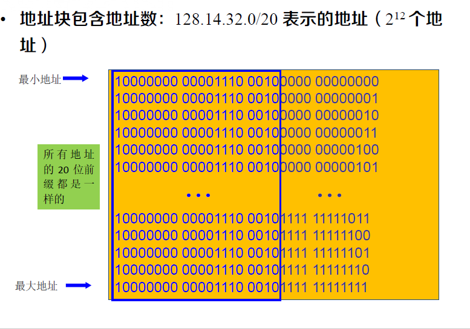
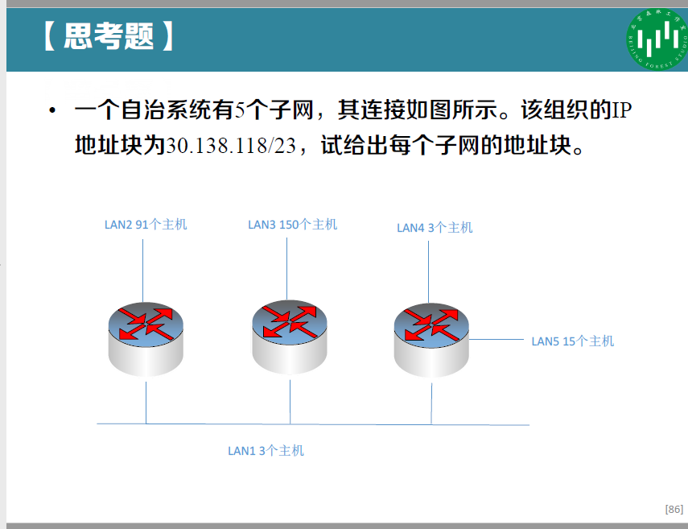

[toc]

crc手算

# 0. Preface

快速查找，请在本档内搜索：

- 计算题  `计算题在此` 。**<font color = 'red'><u>（计算题在此）</u></font>**
- 不清楚的点  `(我不懂的问题点)`


# 概念重点

## Ch 1

### 什么是信息

信息是客观事物运动状态的**表征和描述**。 ”表征“是客观存在的，而“描述” 是主观人为的。

### 什么是网络

网络是在物理上或（和）逻辑上，按一定拓扑结构连接在一起的多个节点和链路的集合，是由具有无结构性质的节点与相互作用关系构成的体系。

## Ch 2

### 数据通信系统的组成

- **报文**：进行通信的信息（数据）
- **发送方**：发送报文的设备
- **接收方**：接受报文的设备
- **介质**：报文从发送者到接受者之间所经过的物理通路
- **协议**：管理数据通信的一组规则，表示通信设备之间的约定

### 网络性能指标

- **吞吐量**：单位时间内传输的信息量，每秒钟传输的比特数b/s

- **时延**：一个报文或分组从一个网络（或一 条链路）的一端传送到另一端所需的时间；
- $ 时延 = 传输时延(发送时延)+ 传播时延+ 处理时延 $ **<font color = 'red'><u>（计算题在此）</u></font>**
    - $发送时延 =\frac{数据块长度L}{信道带宽R}$
    - $传播时延=\frac{信道长度D}{电磁波在信道的传播速率V}$
    -  处理时延
        - 这是数据在交换结点为存储转发而进行一些必要的处理所花费的时间。
        - 其中，排队时延是处理时延中的重要组成部分。因此，处理时延的长短往往取决于网络中当时的通信量。当网络的通信量很大时，还会发生队列溢出，使分组丢失，这相当于处理时延为无穷大。有时可用排队时延作为处理时延。


### 协议

#### OSI参考模型



 **OSI 模型本身并不是网络体系结构 ，因为它并没有定义每一层的服务和所用的协议， OSI 模型的意义在于指明了每层应该做些什么事 。**


#### TCP/IP协议


    
1. **物理层**：        负责将 **比特** 从一个 **节点** 传送到下一个 **节点**
2. **数据链路层**：负责将 **帧** 从一个 **节点** 传送到下一个 **节点**
3. **网络层**：        负责将来 **分组** 从 **信源** 送到 **目的地**
4. **传输层**：        负责将 **报文** 从一个 **进程** 传送到另一个 **进程**
5. **应用层**：        负责 **向用户** 提供服务


### 数据通信网传输

#### 通信方式

- x工通信
  - **单工通信**：指消息只能**单方向传输**的工作方式。通信的双方中只有一个可以进行发送，另一个只能接收。
    - 例：广播、遥测、遥控、无线寻呼。
  - **半双工通信**：指通信**双方都能收发消息**，但**不能同时**进行收和发的工作方式。
    - 例：使用同一载频的普通对讲机问询及检索
  - **全双工通信**：指通信双方可**同时**进行收发消息的工作方式。一般情况全双工通信的信道必须是双向信道。
    - 例：电话
  
- 串行、并行传输
  - **并行传输**：将代表信息的数字信号码元序列以**成组的方式**在两条或两条以上的**并行信道**上**同时传输**。
    - 例如8比特代码字符可以用8条信道并行传输
  - **串行传输**：将数字信号码元序列以**串行方式**一个码元接一个码元地在**一条信道**上传输。
  - 
  
- 同步、异步传输
  - **同步传输**：为了正确解释从发送方接收到的信号，**接收方的位间隔必须与发送方的位间隔严格对应**。
  
  - **异步传输**：将**比特分成小组**进行传送，小组可以是8位的1个字符或更长。每一个字符的开始和结束的地方加上标志，即**加上开始位和停止位**，以便使接收端能够正确地接受每一个字符。
  
- 基带、频带传输
  
  - 依据传输信号是**基带信号**还是**调制后的频带信号**可分为基带传输和频带传输。
  - 
  
- 信道复用

  - 频分：是将用于传输信道的总带宽划分成若干个子频带（或称子信道），每一个子信道传输1路信号。
  - 时分：不同时段来传输不同的信号。
  - 波分：一根光纤中同时传输多个不同波长的光信号。
  - 码分[**<font color = 'red'>（计算题在此）</font>**](#码分复用)：用一组包含**互相正交码字的码组**携带多路信号。 
      - 每个站被指派一个唯一的 m 位码片序列。
      - 如发送比特 1，则发送自己的 m bit 码片序列。
      - 如发送比特 0，则发送该码片序列的二进制反码。
  
- 数据交换
  
  - 概念
    - **电路交换**：是在用户开始通信前，先申请建立一个 **从发送端 到 接收端 的物理信道**，并且 **在双方通信期间始终占用该信道** 。
    - **报文交换**：是以 **报文** 为数据交换的单位，报文携带有 **目标地址、源地址**等信息，在交换结点 对 **报文整体** 采用 **存储转发** 的方式进行传输。报文是 **发送信息整体** ，例如 一个文件 ，长度不受限制。
    - **分组交换**：将一个 **长报文** 先分割为若干个较短的 分组，然后仍采用 **存储转发** 传输方式，把这些分组逐个发送出去。分组又称为“包”，在每一个分组前面，包含一些必要的控制信息组成的 **首部**。分组的首部也称为“包头”。
  - 对比
      - **电路交换**： **整个报文** 的比特流 连续地从源点直达终点
      - **报文交换**： **整个报文** 先传送到相邻结点，**全部** **存储** 下来后查找 **转发表**，转发到下一个结点
      - **分组交换**： **单个分组** （整个报文的一部分）传送到相邻结点 **存储** 下来后 **查找转发表**，转发到下一个结点。
  - 优缺点
      - 要 **连续传送大量的数据** ，且其**传送时间 远大于 连接建立时间**，则 **电路交换** 具有传输速率较快的优点。
      - **报文交换和分组交换**不需要预先分配传输带宽，在 **传送突发数据** 时可提高整个网络的信道利用率。**分组交换比报文交换的时延小**，但其结点交换机必须具有更强的处理能力。
  - 报文交换与分组交换
      - 相同：均采用 存储 - 转发 交换方式 
      - 不同：
          - **报文交换 **以 **完整报文** 进行“存储-转发” 
          - **分组交换** 以 **较小的分组** 进行“存储-转发”
  - 时延计算[**<font color = 'red'>（计算题在此）</font>**](#报文交换 分组交换 时延)
      - 

## Ch 3

### 3.2 有线网络和无线网络

#### 传输介质

- 有向介质：传输方向和传播范围受到 **介质的物理边界** 限制
    - 双绞线、同轴电缆、光纤
        - **双绞线**：是将两根**相互绝缘**的铜线以**螺旋**的形式紧紧绞在一 起得到的，当两根线绞在一起后，不同电线产生的**干扰波会相互抵消**， 从而能显著**降低电线的辐射**，这样**能量损耗越少**，**传输的距离也就越远**。信号通常以**两根线的电压差**来承载，这样可以**有效降低外部噪声的干扰**。
        - 同轴电缆：一种是50Ω电缆，用于数字传输；另一种是75Ω电缆，一 般用于模拟传输和有线电视传输
        - **光纤**：传输介质是超薄玻璃纤维，利用玻璃纤传播信号的原理是光的折射、反射。
- 无向介质：**不使用物理导体** 传播电磁波
    - 真空


### 3.3 局域和广域网络 **（数据链路层）**

- 数据链路层主要任务
    - **介质访问控制**：当两台或者两台以上设备连接到同一个链路 时，需要**数据链路层**决定**哪台设备**在什么时间具有控制权。 
    - **分帧和寻址**：数据链路层将接收自**网络层的分组**划分成便于 管理的数据单元，称为**帧**。数据链路层会给帧加上**首部，定义该帧的发送方或接收方**。
    - **差错控制**：通过加入**检测和重传**机制，提高可靠性。通常是 通过给帧增加**尾部**来实现的。

#### 介质访问控制 MAC

多方共用信道，使用权如何确定？
- 静态划分信道
  - 频分多址、时分多址、码分多址 … 
- 动态媒体接入控制（多点接入）
  - 竞争策略：随机接入，如以太网
      - 如何减少冲突，冲突后如何办
  - 无竞争策略：受控接入 ，如令牌环或轮询
      - 在集中或分布式控制下轮流接入
  - 有限竞争策略

##### 竞争策略

###### ALOHA

- 发送站：有数据需要发送时，就直接传输。
- 中央计算机站：广播其接收到的数据。
    - 没有冲突，发送站收到广播数据，确认其发送成功。
    - 有冲突，发送站等待随机一段时间，再次发送。

###### CSMA

载波侦听：发送站在发送数据前 先侦听信道，判断是否有他站发送了数据 ，依据侦听结果调整行为减少冲突。

依据侦听到**信道冲突**后，处理方式的不同可分为

- 1 - 坚持 CSMA
  - 信道空闲，发送数据；
  - 信道忙，不发送数据，并 **坚持侦听** 信道，一旦侦听到信道空闲，就一定发送数据 。
- 非坚持 CSMA
  - 信道空闲， 发送数据；
  - 信道忙， **并不坚持侦听** ，而是等待一段随机时间，再重复 侦听。
- p - 坚持 CSMA
  - 信道空闲 ，以 **概率 p** 发送数据，以 **概率 1-p** 不发送数据。
  - 信道忙，则 **等待一段随机时间**，**再重复侦听**。 
- **CSMA/CD**    带冲突检测的 CSMA
    - 冲突检测：当 **站检测到它所接收到的信号比它发送的信号强**时，就认为发生了冲突
    - CSMA/CD **不适用于广域网** ，因为时延太大，争用期大，碰撞概率大，性能低。
    - 

##### 无竞争策略

- 位图协议
  - 基本位图法中每个竞争期包含**N个时间槽**，分别对应N个站。
- 令牌传递
  - 令牌传递的性能类似于位图协议，但是因为**周期内所有位置是均等的**，所以不存在偏向低编号或者高编号
- 二进制倒计数
    - 如果一个站想要使用信道，它就以 **二进制位串的形式从高 序的位开始广播自己的地址** 。不同站地址中相同位在同时发送时被 **信道布尔或** 在一起。
    - 为了避免冲突，一个站只要看到**自己发送的地址中的0值被改变成1**，则它必须 **放弃竞争**。
    - 信道利用率为 $$d/(d+log2N)$$ 。如果设计合理，使得发送方的地址正好是帧内的第一个字段，那么，这log2N位也不 会被浪费，进而让信道利用率达到100%。

##### 有限竞争策略


#### MAC帧

常用的以太网MAC帧格式有两种标准
- DIX Ethernet V2 标准
- IEEE 的 802.3 标准
- **最常用的 MAC 帧是以太网 V2 的格式**


**帧格式** **64 - 1518字节**


- **地址字段（两个）**：（6字节，48位）* 2
    - 站的源地址具有**全球唯一性**。即每个站具有一个唯一的标识， 也称为MAC地址。
    - **前三个字节**由IEEE的注册管理机构负责分配。该地址块的 正式名称是**组织统一标识符**（Organizationally Unique Identifier， OUI），通常也叫做**公司标识符** （company id）。
    - **后三个字节**由生产厂家自行指派，称为**扩展标识符** （Extended Unique Identifier）。
    - 由于生产网络设备时，这6个字节的MAC地址已经被**固化** 了，因此MAC地址也被称为**硬件地址或者物理地址**。
    - 如果目标地址的**第一位是0**，则表示这是一个**普通地址**；
    - 如果目标地址的**第一位是1**，则表示这是一个**组地址**。组地址允许多个站同时 监听一个地址。当某个帧被发送到一个组地址，**该组中所有 站都要接收它**。这种一组地址的发送行为称为**组播** （multicasting）。
    - 由**全1**组成的特殊地址保留作为广播（broadcasting）。 如果一个帧的目标地址字段为全1，则它被网络上的**所有站**接收。
- 类型字段：2 字节
    - 用来标志**上一层使用的是什么协议**，以便把收到的 MAC 帧的数据上交给上一层的这个协议。
- 数据字段：46 ~ 1500 字节
    - 当数据字段的长度**小于 46 字节时**， 应在数据字段的后面加入整数字节的填充字段， **以保证以太网的 MAC 帧长不小于 64 字节**。
    - 数据长度的上界是由于当时网络设备的内存（RAM）的限制而决定的。RAM在1978年还是很昂贵的。
    - 数据长度的下界长度的设计考虑了两个因素。
        - 是为了**区别有效帧和垃圾数据**。当**收发器检测到冲突时**，它会截断当前的帧，这意味着冲突帧中已经发送的 位将出现在广播信道上。但由于这些被截断的数据长度小 于正常帧，所以可利用长度来判断是有效帧还是垃圾数据。 
        - **为了保证所有站点在发送完一个帧之前能够检测出 该帧是否发生了碰撞**。
            - 如果一个站试图传送非常短的帧，则虽然 $t=\tau$ 时刻发生了冲突，但 是在突发噪声回到发送方 $t=2\tau$ 之前，传送已经结束。 发送方这段时间内没有收到冲突噪声，就会以为刚才一帧 已经成功发送。为了避免发生这样的情况，要求所有帧必须至少需要2τ 时间才能完成发送。当B站检测到它所接收到的信号比它发送的信号强时，它知道已经发生了冲突，就放弃自己传送，并且产生一个 48位的突发噪声以警告所有其他站。这样当突发噪声回到发送方时传送过程仍在进行。
            - 如何确定数据长度的下界？[**<font color = 'red'>（计算题在此）</font>**](#数据字段长度下界)
- 校验和字段：4字节
    - CRC循环冗余码[**<font color = 'red'>（计算题在此）</font>**](#CRC计算)

#### 差错控制

CRC循环冗余码[**<font color = 'red'>（计算题在此）</font>**](#CRC计算)


### 3.4 局域网

局域网

- 共享式以太网
- 交换式以太网 
- 高速以太网
- 无线局域网
- 虚拟局域网 

#### 共享式以太网与交换式以太网

**交换机**

- 集线器只是在电气上简单地连接所有连接线，就像把它们焊接在一起，不能增加容量，因为它们逻辑上等同于单根电缆的经典以太网 。
- 随着越来越多的站加入，每个站获得的固定容量共享份额下降 。 为了处理不断增长的负载 出现了 以 交换机 为核心的 交换式以太网 。
- - 优势：通过 电缆把交换机或者集线器与一台计算机连接。通过简单的插入或者拔出电缆就能完成增加或者删除一台机器，并且由于片状电缆或者端口通常只影响到一台机器，因此大多数错误都很容易被发现。
    - 缺点：如果集线器或者 交换机本身 发生 的故障 ，则所 有站都 会 失去网络连接 。

**冲突域不同**

- 在**集线器**中，所有站都位于**同一个冲突域**（ collision domain ），它们必须使用 CSMA /CD 算法来调度各自的传输。
- 在**交换机**中，**每个端口有自己独立的冲突域**。通常情况下，电缆是全双工的，站和端口可以同时往电缆上发送帧，根本无须担心其他站或者端口。因为不会发生冲突，因而也就不需要用CSMA /CD 。如果电缆是半双工的，则站和端口必须以通常的 CSMA /CD 方式竞争传输。

**带宽**

- 对于普通 10 Mb/s 的共享式以太网，若共有 N 个用户，则每个用户占有的平均带宽只有总带宽的 N 分之一 。
- 使用以太网交换机时，虽然在每个接口到主机的带宽还是10 Mb/s ，但由于一个用户在通信时是 独占 而不是和其他网络用户共享传输媒体的带宽，因此对于拥有 N 对接口的交换机的总容量为 N 10 Mb/s 。

#### 快速以太网

保持以太网的接口、帧格式和过程规则不变，但是传输速 率升级为100Mbps，哪些必须要变呢？

- 保持最小帧长仍为64byte，传输速率升级为100Mbps
- 争用期变为5.12𝜇𝑠
- 网段最大电缆长度减少至原数据的十分之一，约100m

#### 千兆以太网

千兆以太网采用IEEE 802.3z标准，该标准使用IEEE 802.3协议规定的帧格式，允许全双工和半双工两种工作 方式。

- 全双工方式时，不需要使用CSMA/CD协议。
- 半双工方式时，就必须进行碰撞检测。由于数据率提高了， 因此只有**减小最大电缆长度或增大帧的最小长度**，才能保证信道效率。
- 千兆以太网仍然保持一个网段的**最大长度为100 m**，但采用了“载波延伸”（carrier extension）的 办法，使 **最短帧长仍为64字节（这样可以保持兼容性）， 同时将争用期增大为512字节**。凡发送的帧长不足512字 节时，就用一些特殊字符填充在帧的后面，使**MAC帧的 发送长度增大到512字节**，这对有效载荷并无影响。接收端在收到以太网的MAC帧后，要把所填充的特殊字符删除后才向高层交付。
- 当原来仅64字节长的短帧填充到512字节时，所**填充的 448字节就造成很大的开销**。为此，千兆以太网还增加一 种功能称为**分组突发**（packet bursting）。这就是当 很多短帧要发送时，第一个短帧要采用上面所说的载波延 伸的方法进行填充。但随后的一些短帧则可一个接一个地 发送，它们之间只需留有必要的帧间最小间隔即可。这样 就形成一串分组的突发，直到达到1500字节或稍多一些为止。

#### 万兆以太网

- 万兆以太网（10 Gbps Ethernet，10GE）采用IEEE 802.3标准的补充标准IEEE 802.3ae。
- 为了保证用户升级现有以太网，同时仍能和较低速率的以太网通信。**万兆以太网的帧格式和10Mbps，100Mbps 和1Gbps以太网的帧格式完全相同**。
- 10GE**只工作在全双工方式**，因此不存在争用问题，也**不**使用CSMA/CD协议。这就使得10GE的传输距离不再 受碰撞检测的限制而大大提高了。
- 10GE**只使用光纤**作为传输媒体。
    - 单模光纤，40km，广域网和城域网的范围。
    - 多模光纤，传输距离为65到300m。

#### 无线局域网的特殊问题

##### 802.11的MAC协议

**无线局域网不能简单地搬用 CSMA/CD 协议**。这里主要有两个原因。

- 对于无线信道，接收信号强度往往会远远小于发送信号强度。**无线信道难以实现碰撞检测 。**

- 对于无线信道，信号会向各个方向传播，并且传播距离受限，这就带来两个特殊问题： **隐蔽站问题 和 暴露站问题** 。

- 05 p7

    - 隐蔽站问题：当A 和 C都想和B通信，但由于 检测不到对方的无线信号，都以 为信道是空闲的，因而都向 B 发送数据，结果发生碰撞。

        

    - 暴露站问题：假设站B正在向A发送数据，而C又想和D通信。但C检测到媒 体上有信号，于是就不敢向D发送数据。其实B向A发送数据 并不影响C向D发送数据。

        

##### CSMA/CA 协议

无线局域网不能使用 CSMA/CD，需要改进的 CSMA 协议。 

- 802.11的MAC层 ：
    - 增加点协调层。
    - 载波侦听/碰撞避免（ CSMA/CA） 协议。
        - 帧间间隔
        - 虚拟载波侦听
        - 确认机制
        - 信道可预约（可选）

#### 虚拟局域网

**交换机可以很方便地实现虚拟局域网。**

- 管理员可以将连接在交换机上的站点按需要划分为多个与 物理位置无关的逻辑组，每个逻辑组就是一个VLAN。
- 属于同一VLAN的站点之间可以直接进行通信，而不属于 同一VLAN的站点之间不能直接通信
- 连接在同一交换机上的两个站点可以属于不同的VLAN， 而属于VLAN中的两个站点可能连接在不同的交换机上。 

**虚拟局域网其实只是局域网给用户提供的一种服务，而不是一种新型局域网！**


## Ch 4 网络层

网络层主要任务

- **逻辑寻址**：物理寻址负责处理本地网络的寻址问题，有数据链路层实现。如果分组来自网络边界，就需要另一种寻址系统，即网络层的逻辑寻址。
- **路由选择**：当独立的网络或者链路被连起来组建为一个互联网络时，链接设备对分组进行路由或者交换，使其达到最终目的地。


### IP协议

点分十进制记法。

IP地址是32位的二进制代码。

#### IP地址

##### 分类编址


|      | 最大可指派的网络数     | 第一个可指派的网络号 | 最后一个可指派的网络号 | 每个网络中的最大主机数($2^{host\_id位数}-2$) |
| ---- | ---------------------- | -------------------- | ---------------------- | -------------------------------------------- |
| A    | $2^7-2=126$ (全零不用) | 1                    | 126                    | $2^{24}-2=16777214$                          |
| B    | $2^{14}-1=16383$       | 128.1                | 191.255                | $2^{16}-2=65534$                             |
| C    | $2^{21}-1=2097151$     | 192.0.1              | 233.255.255            | $2^{8}-2=254$                                |

| 网络号 | 主机号       | 源地址使用 | 目的地址使用 | 含义                                     |
| ------ | ------------ | ---------- | ------------ | ---------------------------------------- |
| 0      | 0            | Y          | N            | 在本网络上的本主机                       |
| 0      | host-id      | Y          | N            | 在本网络上的某个主机 host-id             |
| 全1    | 全1          | N          | Y            | 只在本网络上进行广播（各路由器均不转发） |
| net-id | 全1          | N          | Y            | 对net-id上的所有主机进行广播             |
| 127    | 非全0或非全1 | Y          | Y            | 用作本地软件环回测试之用                 |


##### 划分子网编址

又增加了一个“子网号字段”，使两级的 IP 地址变成为三级的 IP 地址。

划分子网只是对IP地址的**主机号host-id**这部分进行再划分，而**不改变IP地址原来的网络号**。

划分子网纯属一个单位内部的事情。单位对外仍然表现为没有划分子网的网络。从 主机号借用若干个位作为子网号 subnet-id，而主机号 host-id 也就相应减少 了若干个位。

###### 子网掩码

在划分子网编址中，IP地址本身并不能指明网络号、子网号和主机号。

因此，每个网络都需要配合使用32位的子网掩码。

计算网络地址的方法是将地址掩码与IP地址逐位相与 （AND），就得到了子网的网络地址。

##### 无分类编址（CIDR）

无分类域间路由选择CIDR

CIDR使IP地址从三级编址（使用子网掩码）又回到 了两级编址，但这已是无分类的两级编址。

计算网络地址的方法仍然是将地址掩码与IP地址逐位相与 （AND），得到 IP 地址中的网络前缀。

求网络前缀[**<font color = 'red'>（计算题在此）</font>**](#求网络前缀)

计算CIDR地址块地址数[**<font color = 'red'>（计算题在此）</font>**](#计算地址块地址数)

CIDR 地址块划分[**<font color = 'red'>（计算题在此）</font>**](#地址块划分)

###### CIDR VS 划分子网

 注意：“CIDR不使用子网”是指CIDR并没有在32位地 址中指明若干位作为子网字段（subnet-id）。但分配 到一个CIDR地址块的组织，仍然可以在本组织内根据需 要划分出一些子网。

例如，某组织分配到地址块/20，就可以再继续划分为8 个子网 （即需要从主机号中借用3位来划分子网）。这时 每一个子网的网络前缀就变成23位，比该组织的网络前 缀长3位。

使用CIDR的一个好处就是可以更加有效地分配IPv4的地 址空间，**可根据客户的需要分配适当大小的CIDR地址块**。

###### 路由聚合及最长前缀匹配

路由器通过查找路由表来把IP数据报转发到相应的端口。 路由表一行对应一个网络。随着因特网迅速发展，连接的 网络越来越多，路由表也越来越大，路由器查找路由表的 时间也越来越长。

采用路由聚合来缓解这个问题。 

路由聚合又称为地址聚合，是指路由表中的某些路由相同 的表项合并为一个。

在使用CIDR时，前面的例子提到，不同的子网掩码可能 得到相同的匹配结果，这样就带来一个问题：如何从这些 相同匹配结果中选择合适的路由呢？

正确的答案是应当从匹配结果中选择具有最长网络前缀的 路由，即最长前缀匹配（longest-prefix matching） – 因为网络前缀越长，其地址块就越小，因而路由就越具体 （more specific）。


#### IP数据报


一个 IP 数据报由首部和数据两部分组成。

- 首部的前一部分是固定长度，共 20 字节，是所有 IP 数据 报必须具有的。
- 在固定部分的后面是一些可选字段，其长度是可变的。

### ARP/RARP协议


#### ARP


如果所要找的主 机和源主机**不在同一个局域网**上，那么就要**通过 ARP 找 到一个位于本局域网上的某个路由器的硬件地址**，**然后把 分组发送给这个路由器，让这个路由器把分组转发给下一 个网络**。

#### RARP

### IP分组转发流程

[**<font color = 'red'>（计算题在此）</font>**](#分组转发)

IP数据报的转发是由路由器查找路由表来实现的。

1. 从收到的数据报**首部**提取**目的IP地址D**。
2. 先判断是否为**直接交付**。对与此路由器**直接相连**网络逐个进 行检查，即**各网络的掩码和D逐位相“与”（AND操作），看 是否和相应的网络地址匹配**。若匹配，则把分组进行直接交付 （当然还需要把D转换成物理地址，把数据报封装成帧发送出 去），转发任务结束。**否则就是间接交付**，执行(3)。
3. 对**路由表**中的每一行，用其中的**掩码和D逐位相“与” （AND操作），其结果为N。若N与该行的网络地址匹配，则 把数据报传送给该行指明的下一跳路由器**；否则，执行(4)。 
4. 若路由表中有一个**默认路由**，则把数据报传送给路由表中所 指明的默认路由器；否则，执行(5)。
5. 报告转发数据报出错。

### ICMP协议

为了提高 IP 数据报交付成功的机会，在网际层使用了网 际控制报文协议 ICMP (Internet Control Message Protocol)。

ICMP 允许主机或路由器报告差错、提供异常。


#### ICMP的应用举例

- PING (Packet InterNet Groper)**分组网间探寻**
    - PING 用来**测试两个主机之间的连通性**。 
    - PING 使用了 **ICMP 回送请求与回送回答报文**。 
    - PING 是**应用层直接使用网络层 ICMP** 的例子，它没有通过运输层的 TCP 或UDP。
- Traceroute
    - Traceroute 用来**跟踪一个分组从源点到终点的路径**。 
    - Traceroute是unix系统中的名字，**Windows操作系统中这个命令叫tracert**。 
    - tracert 使用了 **ICMP 时间超过差错报告报文**和**终点不可达差错报告报文**。
    - tracert 是**UDP协议调用ICMP协议**的例子

### 路由选择协议

内部网关协议 IGP ：即在一个自治系统内部使用的路由选择协议。 目前这类路由选择协议使用得最多，如 **RIP 和 OSPF 协议**。

外部网关协议EGP：若源站和目的站处在不同的自治系统中，使用 外部网关协议。在外部网关协议中目前使用的是 **BGP-4**。

#### 内部网关协议 IGP

##### 路由信息协议RIP

- 是一种分布式路由选择协议
- 是一种分布式的基于距离向量路由算法的协议，

- 是内部网关协议中广泛使用的协议。
- 是因特网的标准协议
- 其最大优点就是简单。
-  
    - 和哪些路由器交换信息？
        - 仅和相邻路由器交换信息。
    - 交换什么信息？
        - 交换的信息是当前本路由器所 知道的全部信息，即自己的路 由表。
    - 在什么时候交换信息？
        - 按固定的时间间隔交换路由信 息，例如，每隔 30 秒。当网 络拓扑结构发生变化时，路由 器也及时向相邻路由器通告拓 扑变化后的路由信息。
- 
- RIP路由表更新[**<font color = 'red'>（计算题在此）</font>**](#RIP路由表更新)
- 优缺点
    - RIP 存在的一个问题是当网络出现故障时，要经过比较长的时间 才能将此信息传送到所有的路由器。
    - RIP 协议最大的优点就是实现简单，开销较小。
    - RIP 限制了网络的规模，它能使用的最大距离为 15（16 表示不 可达）。
    - 路由器之间交换的路由信息是路由器中的完整路由表，因而随着 网络规模的扩大，开销也就增加。

##### OSPF协议

- 是分布式路由协议
-  
    - 和哪些路由器交换信息？ 
        - 向**本自治系统中所有路由器**发送信息，这里使用的方法是**洪泛法**。路由器通过所有输出端口向所有相邻的路由器发送信 息。而每一个相邻路由器又再将此信息发往其所有的相邻路 由器（但不再发送给刚刚发来信息的那个路由器）。这样， 最终整个区域中所有的路由器都得到了这个信息的一个副本。
        - 相应地，RIP协议是仅仅向数目有限的几个相邻的路由器发送信息。
    - 交换什么信息？
        - 发送的信息就是与**本路由器相邻的路由器**的链路状态，注意， 这只是路由器所知道的**部分信息**。“链路状态”就是说明**本 路由器都和哪些路由器相邻**，以及该链路的**“度量”**(metric)。 OSPF中“度量”可以表示**费用、距离、 时延、带宽**等等，较为灵活。
        - 相应地，RIP协议发送的信息则是：“**到所有网络的距离和下一跳路由器**”。
    - 在什么时候交换信息？ 
        - 只有**当链路状态发生变化时**，路由器才用洪泛法向所有路由 器发送此信息。
        - 相应的，RIP协议不管网络拓扑有无发生变化，路由器之间都要**定期**交换路由表的信息。

##### OSPF VS RIP

由于一个路由器的链路状态只涉及到与相邻路由器的连通 状态，因而与整个互联网的规模并无直接关系。**因此当互 联网规模很大时，OSPF 协议要比距离向量协议 RIP 好 得多。** 

**OSPF 没有“坏消息传播得慢”的问题**，据统计，其响应 网络变化的时间小于 100 ms。

#### 外部网关协议 BGP

AS系统之间的路由选择协议

##### BGP

BGP（Broder Gateway Protocol）协议

- BGP协议中，每一个**AS的管理员**要选择**至少一个路由器** 作为该自治系统的“ **BGP 发言人**” (BGP speaker) 。 
- BGP发言人**往往就是 BGP 边界路由器**。当然，也可以 不是 BGP 边界路由器。
- **BGP发言人负责在AS之间交换路由信息**。
    - 如何交换路由信息？
        - 交换路由信息的过程利用 **TCP协议**。先建立TCP连接， 然后在此连接上交换 **BGP 报文**以**建立 BGP 会话 (session)**，**利用 BGP 会话交换路由信息**。
        - **使用TCP连接能提供可靠的服务**，**也简化了路由选择协议**。
    - 交换什么样的路由信息呢？ 
        - BGP采用了**路径向量（path vector）路由选择协议**， BGP发言人所交换的**网络可达性信息**就是要到达某个网络 所要经过的**一系列 AS**。
    - 当 BGP 发言人**互相交换了网络可达性的信息后**，各 BGP 发言人就**根据所采用的策略**从收到的路由信息中**找 出到达各 AS 的较好路由**。

### 路由器工作原理

路由器是一种具有**多个输入端口和多个输出端口**的专用计 算机，其任务是**转发分组**。**也就是说，将路由器某个输入端口收到的分组，按照分组要去的目的地（即目的网络）， 把该分组从路由器的某个合适的输出端口转发给下一跳路由器**。下一跳路由器也按照这种方法处理分组，直到该分 组到达终点为止。

按照网络分层体系结构，**路由器工作在网络层**。

**路由器与交换机的差别，路由器是属于OSI第三层的产品， 交换机是OSI第二层的产品**。

### IPv6

- IPv6中每个地址占用16个字节，即128位。

- 冒号十六进制记法
    - 与IPv4不同，IPv6使用冒号分十六进制记法
    - 16个字节被分成8组来书写，每一组4个十六进制数字，组之间用冒号隔开，如下所示


#### ipv4与ipv6固定首部的区别

- IPV4 首部 固定 部分 (20B)

- IPv6 的 基本首部 （40 B）
- 


#### 从 IPv4 向 IPv6 过渡

**双协议栈(dual stack)**是指在完全过渡到 IPv6 之前， 使一部分主机（或路由器）装有两个协议栈，一个 IPv4 和一个 IPv6。

**隧道（tunnel）**是指将一种协议报文**封装**到另一种协议报文中，这样，一种协议就可以通过另一种协议的封装进行通信。


## Ch 5 运输层

运输层为相互通信的应用**进程**提供了逻辑通信

### 运输层端口

端口就是**应用进程的运输层地址**。

端口的作用就是让应用层的各种**应用进程**都能将其数据**通过端口向下交付给运输层**，以及**让运输层知道应当将其报 文段中的数据向上通过端口交付给相应的应用层进程**。 

从这个意义上讲，端口是用来标志应用层的进程。

### UDP

UDP在传送数据之前**不需要先建立连接**。对方的运输层在 收到 UDP 报文后，**不需要给出任何确认**。虽然 UDP **不 提供可靠交付**，但在某些情况下 UDP 是一种最**有效**的工 作方式。

- UDP 的特点
    - UDP 是**无连接**的，即发送数据之前不需要建立连接（当然发送数据结束时也没有连接可释放），因此**减少了开销和发送数据之前的时延**。
    - UDP 使用尽最大努力交付，即**不保证可靠交付**，同时也不使用拥塞 控制，因此主机不需要维持具有许多参数的、复杂的连接状态表。
    - 由于 UDP 没有拥塞控制，因此**网络出现的拥塞不会使源主机的发送 速率降低**。这对某些**实时应用**是很重要的。很多的实时应用（如 IP 电话、实时视频会议等）要求源主机以恒定的速率发送数据，并且允许在网络发生拥塞时丢失一些数据，但却不允许数据有太大的时延。 UDP 正好适合这种要求。
    - UDP 是**面向报文**的。这就是说，**UDP 对应用程序交下来的报文不 再划分为若干个分组来发送，也不把收到的若干个报文合并后再交付 给应用程序**。 
        - 应用程序交给 UDP 一个报文，UDP 就发送这个报文；而 UDP 收到一个报文，就把它交付给应用程序。
        - **应用程序必须选择合适大小的报文**。
    - UDP 支持**一对一、一对多、多对一和多对多**的交互通信。
    - 用户数据报只有 8 个字节的首部开销，比 TCP 的 20 个字节的首部要短。
- UDP 的首部格式
    - 用户数据报 UDP 有两个字段：数据字段和首部字段。首 部字段有 8 个字节，由 4 个字段组成，每个字段都是两 个字节。
    - 
    - 在计算检验和时，临时把“伪首部”和 UDP 用户数据报 连接在一起。伪首部仅仅是为了计算检验和。
    - 
- 套接字地址
    - UDP通过**二元组（目的IP地址，目的端口号）**来标识一个接收方进程，用二元组（源IP地址，源端口号）来标识 一个发送方进程。二元组（IP地址，端口号）被称为**套接 字（socket）地址**。
    - 如果接收方UDP发现收到的报文中的**目的端口号不正确 （即不存在对应于该端口号的应用进程）**，就丢弃该报文， 并由**ICMP发送“端口不可达”差错报文**给发送方。
    - 前文讨论traceroute 时，就是让发送的UDP用户数据 报故意使用一个非法的UDP端口，结果ICMP就返回 “端口不可达”差错报文，因而达到了测试的目的。

### TCP

TCP 则提供面向连接的服务。TCP 不提供广播或多播服 务。由于 TCP 要提供可靠的、面向连接的运输服务，因 此不可避免地增加了许多的开销。这不仅使协议数据单元 的首部增大很多，还要占用许多的处理机资源。

- TCP 的主要特点
    - TCP 是面向连接的运输层协议。 
    - 每一条 TCP 连接只能有两个端点(endpoint)，每一条 TCP 连接只能是点对点的（一对一）。
    - TCP 提供可靠交付的服务。通过TCP连接传送的数据， 无差错、不丢失、不重复、并且按序到达。
    - TCP 提供全双工通信。
    - 面向字节流。

- TCP中的“流”
    - TCP中的“流”（stream）指的是**流入到进程或从进程流出的字节序列**。
    - “面向字节流”的含义是：虽然应用程序和TCP的交互是**一次一个数据块**（大小不等），但TCP这些数据都看成是**一连串的无结构的字节流**。TCP并**不关心所传送的字节流的含义**，也**不保证接收方应用程序所收到的数据块和发送方应用程序所发出的数据块的大小对应关系**。但接收方应用程序收到的字节流必须和发送方应用程序发出的**字节流完全一样**。
- 一对一的通信
    - 由于运输层的通信是面向连接的，因此**TCP 每一条连接上的通信只能是一对一的**，而不可能是一对多、多对一或 多对多的。
- 首部：**固定首部20字节**
- TCP 的连接管理
    - TCP的连接建立
        - TCP 的连接和建立都是采用**客户服务器**方式。主动发起连接建立的应用进程叫做客户(client)。被动等待连接建立的应用进程叫做服务器(server)。
        - 用**三次握手建立 TCP 连接**
        - 
        - 为什么A需要再一次发送确认？
            - **防止已失效的连接请求报文段又传送到B，因而产生错误**。
        - 为什么会出现“已失效的连接请求报文段”？ 
            - 假定这样的场景：A 发出连接请求，但第一个连接请求未 收到确认，A再重传一次。后来收到了确认，建立了连接。 数据传输完毕后释放了连接。所以，A 共发送了两个连接 请求报文段，其中第一个，也就是之前没有被B接受到的那 个，过了一段时间又传送到 B。
            - 如果只握手两次： B 误认为是 A 又发出一次新的连接请求。 于是就向 A 发出确认报文段，同意建立连接。由于A不会 理睬B的确认 。但B却以为运输连接就这样建立了，并一直 等待A发来数据。 B的许多资源就这样白白浪费了。
    - TCP 的连接释放
        - 


## Ch 6 应用层

- 应用层主要任务
    - 域名服务系统
    - 万维网访问系统
    - …………

### 应用程序通信方式

- 网络应用程序运行在网络边缘的端系统（主机），通过彼 此间的通信来共同完成某项任务。 

- 通信方式分为：
    - 客户服务器方式
    - 对等连接方式

### 域名系统DNS

- 域名是为了便于人来使用，IP 地址则是便于机器进行处理。
- 域名系统DNS (Domain Name System)并不是直接和用户打交道的网络应用程序，DNS为其他各种网络应用提供一种核心服务，即名字服务，用来把计算机的名字转换为对应的IP地址。

#### 因特网的域名结构

- 因特网采用了层次树状结构的命名方法。

- 域名的结构由标号序列组成，各标号之间用点隔开，各标号分别代表不同级别的域名 

    ```
    xxxxxxxx.三级域名.二级域名.顶级域名
    ```

- 注意：域名中的“点”和点分十进制 IP 地址中的“点” 并无一一对应的关系。

#### 域名的解析过程

- **主机向本地域名服务器的查询一般都是采用递归查询**。如果主机所询问的本地域名服务器不知道被查询域名的 IP 地址，那么本地域名服务器就以 DNS 客户的身份，向其他根域名服务器继续发出查询请求报文。 
- **本地域名服务器向根域名服务器的查询可以是迭代的也可以是递归的，通常是采用迭代查询**（递归较少用）。当根域名服务器收到本地域名服务器的迭代查询请求报文时， 要么给出所要查询的 IP 地址，要么告诉本地域名服务器： “你下一步应当向哪一个域名服务器进行查询”。然后让本地域名服务器进行后续的查询。

### 万维网概述

- 万维网的工作方式
    - 万维网以**客户服务器**方式工作。 
    - 浏览器就是在用户计算机上的万维网**客户程序**。万维网文档所驻留的计算机则运行服务器程序，因此这个计算机也称为**万维网服务器**。
    - 客户程序向服务器程序发出请求，服务器程序向客户程序 送回客户所要的万维网文档。 
    - 在一个客户程序主窗口上显示出的万维网文档称为**页面 (page)**。
- 统一资源定位符 URL
    - **统一资源定位符 URL**是对**因特网上资源的位置和访问方法**的一种简洁的表示。
    - URL 相当于一个文件名在网络范围的扩展，因此 URL 是与因特网相连的机器上的任何可访问对象的一个**指针**。
    - URL 给资源的位置提供一种抽象的识别方法，并用这种方法给资源定位。只要能够对**资源定位**，系统就可以对资源进行各种操作，如**存取、更新、替换和查找**其属性。
    - URL 的一般形式：由以冒号隔开的两大部分组成，并且在 URL 中的字符对 **大写或小写没有要求**。
- 超文本传送协议 HTTP
    - HTTP协议定义了**浏览器怎样向万维网服务器请求万维网文档**，以 及**万维网服务器怎样把万维网文档传送给浏览器**。
    - HTTP使用的运输层 协议是TCP，默认端口号是80

## 其它协议

### ATM

异步传递方式 ATM (Asynchronous Transfer Mode)就是建立在**电路交换和分组交换**的基础上的一种 **面向连接的快速分组交换**技术，它采用**定长分组**作为传输和交换的单位。

ATM的协议参考模型，包括**物理层、ATM层和ATM适配层**三层。

这3层与TCP/IP协议或OSI的参考模型**无法严格对应**。

### IP over X

#### IP over MPLS

**多协议标记交换（MPLS，Multi-protocol Label Switching）**是在IP over ATM之后，经过模型重叠， 模型集成演变过程，最终由IETF于1997年制定的标准， 是**IP网络的广泛应用与ATM组网技术成熟性相结合的产物**。 • MPLS实用价值在于它能够为**IP这样无连接的网络提供 面向连接的服务**。

- **多协议标签交换MPLS**
    - MPLS在**每个IP数据报前插入MPLS首部**。MPLS首部 给该数据包加上**固定长度标签**（Label），来改善IP路由器的转发速度。 
    - MPLS使用专门的**标签交换路由器**，通过检查**相对短的、 固定长的标签**来转发分组。
- MPLS帧的转发
    - 这些由MPLS标签交换路由器互联的区域称为**MPLS域**。 **在MPLS域中，标签交换路由器不需要提取IP首部目的 地址并在转发表中执行最长前缀匹配的查找，而是直接查找MPLS标签**，将MPLS帧转发到相应端口。
- MPLS的优点在于能**灵活地**为**某些流量指定特定的一条路径**，这种能力被称为**显示路由**。
- MPLS**实现显示路由**的方法是**定义转发等价类FEC** （Forwarding Equivalence Class），依据FEC给 IP数据报**打上标签，属于同一个FEC数据报对应同样的标签**。
- 转发等价类：路由器按照同样方式转发的IP数据报的集合。 这里“同样方式”是指同样的接口、同样下一跳、同样优先 级。
- MPLS的显示路由有助于故障恢复，还能用于实现虚拟专用网VPN 和改进网络的服务质量


## 信息网络基础应用

### 计算机互联网

- 计算机互联网的最简单的定义是：一些互相连接的、自治的计算机的集合。 

- 世界上最大的国际性计算机互联网——因特网。请注意以下两个意思相差很大的名词internet和Internet：
    - **以小写字母i开始的internet**（互联网或互连网）是一个**通用名词**，它泛指由多个计算机互联网互连而成的网络。在这 些网络之间的通信协议（即通信规则）可以是任意的。
    - **以大写字母I开始的Internet**（因特网）则是一个**专用名词**， 它**指当前全球最大的、开放的、由众多网络相互连接而成的特定计算机互联网**，它采用**TCP/IP协议**族作为通信的规则， 且其前身是美国的ARPANET。

### 公共电话网

- 起源于19世纪末的**公用电话交换网PSTN**（Public Switched Telephone Network）是一种以**模拟技术**为基础的电路交换网络，即为**旧式电话系统**。

- 调制解调器（modem）拨号上网
    - 较普遍的接入因特网的方式是**拨号上网**。用户通过**外置或内置的调制解调器（Modem）**使自己的个人电脑通过电话 线接入到因特网，即为调制解调器拨号上网。
    - 调制解调器是**模拟信号和数字信号的转换设备**。
- 利用调制解调器拨号上网能达到的最高速率只能到 **56Kbps**。

#### xDSL

- DSL（数字用户线路，Digital Subscriber Line）是 以**铜质电话线**为传输介质，并利用数字技术对现有的模拟 电话用户线进行改造，使它能够**承载宽带业务**。
- 对于公共电话网而言，虽然**标准模拟电话信号**的频带被限制在**300～3400kHz**的范围内，但**用户线本身实际可通过的信号频率仍然超过1MHz**。xDSL技术就把0～ 4kHz低端频谱留给传统电话使用，而把原来没有被利用的**高端频谱留给用户上网使用**。


### 广播电视网

广播电视网即为传统有线电视网CATV（Cable Television）。由无线电视网发展而来，现在是指将视 频信号传输到社区和居民家中的电缆或光纤铜缆混合系统。

#### 广播电视接入网

- CM方案
    - 是利用HFC网络进行高速数据接入，CM是**电缆调制解调器**（Cable Modem）的简称。
    - 该方案中接入因特网的一端为CMTS（Cable Modem Termination System），客户端为CM
- EPON方案
    - **无源光纤网络**（Passive Optical Network，**PON**） 是一种点到多点的光纤接入技术。
    - **以太网无源光网络**（Ethernet Passive Optical Network，**EPON**）是基于以太网的PON技术。
    - 将以太网和PON技术结合，在物理层采用PON技术，在数 据链路层使用以太网协议，利用PON的拓扑结构实现以太网接入。综合了PON技术和以太网技术的优点：低成本、 高带宽、扩展性强、与现有以太网兼容、方便管理等。
- FTTH方案
    - FTTH（Fiber To The Home）方案则是将光纤直接 接到家庭。
    - FTTH方案又可分为单纤三波传输和双纤传输两种传输方式。
    - 单纤三波传输：把**CATV信号**和**数据语音信号**合并在一根 光纤内，利用波分复用技术在1310nm/1490nm波段传输数据信号、在1550nm波段传输CATV视频信号。 
    - 双纤传输则是利用**两条光纤分别传输数据和CATV信号**。


### 移动通信网

移动通信系统依据用途可分为**专用**移动通信系统和公用移动通信系统。

- 专用移动通信系统：
    - 无绳电话系统
        - **小灵通**
    - 集群移动系统
        - 专用无线调度网的高级发展阶段：**警用数字集群** 
    - 卫星移动通信系统
        - 卫星电话，移动卫星通信系统是指**利用通信卫星作为中继站**，为移动用户之间或移动用户与固定用户之间提供电信 业务的系统。
- 公用移动通信系统
    - 蜂窝移动通信系统
        - 第一代（1G）模拟系统
        - 第二代（2G）数字话音系统
        - 超二代（或2.5G）数字话音/数据移动通信系统
        - 第三代（3G）是宽带数字系统
        - 第四代（4G）是极高速数据速率系统

- 蜂窝移动通信系统
    - 第一代移动通信——大哥大
        - 1978年底，美国AT&T公司的贝尔试验室研制成功**先进移动电话系统（AMPS）**
        - 使用空分复用
            - 建成蜂窝状移动通信网
        - 使用**频分复用**。
            - 频段范围为824~849 MHz的832个单工信道作为**移动电话到基站**的信道。
            - 频率范围为869~894 MHz的另外832个单工信道作为**基站到移动电话**的信道。
            - 每个单工信道的频宽为 30 kHz。
    - 第二代移动通信系统 GSM
        - GSM的4A目标——任何人（anyone）在任何时间 （anytime）、任何地点（anywhere）、任何形式 （anything）的信息。
            - 第一代**系统容量**已不能满足日益增长的移动用户需求
            - 数字网能提供**语音、数据**等多种业务服务，并与**ISDN**等兼 容
        - **频分复用+时分复用**
            - **TDM帧是4.615ms**
            - **TDM帧包含8个时隙 每个时隙0.577ms**
            - **每个时隙：**
                -  **1到7号：业务时隙（数据时隙）**
                -  **0号：控制时隙**
    - 第三代移动通信
        - 第三代系统开始，其设计目标不仅限于**高质量的语音**，还 包括**消息传输**（包括电子邮件、传真、短信等）、**多媒体传输**（音乐、视频）以及Internet接入。
        - 1985年，国际电信联盟（ITU）提出**第三代移动通信系统的概念**，伴随着对第3代移动通信的大量论述以及**2.5G** （B2G）产品**GPRS（通用无线分组业务）**系统的过渡， 3G走上了通信舞台的前沿。
        - 1996年ITU将**3G更名为国际移动通信-2000（IMT2000）**，其含义为该系统预期在2000年左右投入使用， 工作于2000MHz频段，最高传输数据速率为 **2000Kbps**。
        - 空中接口：**欧洲和日本提出的WCDMA，美国提出的 CDMA2000和中国提出的TD-SCDMA**
    - 第四代移动通信系统
        - 第四代移动通信技术（4G）由ITU-R于**2005年10 月**正式命名为**IMT-Advanced**（International Mobile Telecommunications Advanced），其系统性能要求对**慢速移动用户下行峰值速率能够达到1Gbps**，对 **快速移动用户能够达到100Mbps**。
        - 2012年1月18日，ITU在2012年无线电通信全会上，正 式审议通过将**3GPP**提出的**LTE-Advanced**和由 IEEE-SA提出的**802.16m**技术规范确立为IMTAdvanced，即**4G国际标准**。这两大方案均包含时分双 工（TDD）和频分双工（FDD）两种制式。我国主导研制的TD-LTE-Advance（即LTE-Advance-TDD） 也同时成为IMT-Advanced国际标准。
        - 正交频分复用OFDM：是一种多载波调制技术，其主要思想是在**可用频带内**，将信道分成许多**正交的子信道**，每个于信道上使用一个子载波进行调制，从而将**高速数据信号**转换成**并行的低速子数据流**，调制到每个子信道上并行传输，再在接收端采用相关技术来分开正交信号。
    - 第五代移动通信系统
        - 第五代移动通信系统（5G）作为面向2020年以后移动 通信需求而发展的新一代移动通信系统，ITU将其暂命名 为IMT-2020。 
        - IMT-2020（5G）推进组归纳了5G的主要场景和业务需求特征，提炼出**连续广域覆盖、热点高容量、低延时高可靠和低功耗大连接**四个主要技术场景。


# 计算题

## 码距 检错 纠错

书 p37

为检测 $e$ 个错码，要求最小码距 $d_0\geq e+1$

为纠正 $t$ 个错码，要求最小码距 $d_0\geq 2t+1$

为纠正$t$ 个错码，并同时检测 $e$ 个错码，要求最小码距 $d_0\geq e+t+1$

## CRC计算


## 码分复用

02 p38


## 报文交换 分组交换 时延

02 p58


## 数据字段长度下界


## IP

### 判断IP

05 p67



### 求网络前缀


### 计算地址块地址数

 

### 地址块划分



### 分组转发


### RIP路由表更新


# 没用的


~~02 p84 等 网线规格~~


##### 二进制指数后退的 CSMA/CD


载波监听 ”即“先听再发, 先监听信道上传播的信号, 等信道空闲再发送数据

***<u>问题：传播时延对其影响 03 p43</u>***

**冲突检测( CD )**

每次冲突，最多持续占用信道 2 $\tau$ 时间

**退避重传**

检测到冲突停止发送数据后，要推迟（称为 退避r 倍 的 单位退避时间 后 再监听信道 进行重传（ r 为随机的整数）。单位退避时间 要尽可能小，但要保证两站点选择不同的 r 值时，一定不会再发生冲突。

​		*<u>单位退避时间的选择</u>*：至少$2\tau$，又称争用期；推迟$2k\tau$后再监听信道重传


CSMA/CD不适用于广域网，因为时延太大，争用期大，碰撞概率大，性能低。

#### 无竞争策略

##### 位图协议

基本位图法中每个竞争期包含 N 个时间槽 ，分别对应 N 个站。

位图协议**信道利用率**
– 在低负载情况下， 每一帧 的额外开销为 N 位 ，若数据长度为d 位 ，则信道利用率为 d/( d+N 。在高负载情况下，若所有站都有数据需要发送，则 N 为竞争期被分摊到 N 个帧上，因此，每一帧的额外开销只有 1 位，信道利用率则为 d/(d+1) 。

##### 令牌传递

03 p58

令牌传递的性能类似于位图协议 ，但是 因为周期内所有位置是均等的 ，所以不存在偏向低编号或者高编号


#### 有限竞争

有限竞争协议（ limited contention protocol 在 低负载 下采用 竞争的做法 而提供 较短的延迟 在 高负载 下采用 无冲突技术 ，从而获得 良好的 信道 效率 。

有限竞争协议的基本思路是 首先将所有的站划分成组，组内 每个站 之间执行 竞争 策略 ，而 每个 组 之间 执行的是 无冲突协议 ，即每个组 对应一个时间槽。

当 负载较低 时，每个时间槽中的 站点数就多一些 。当 负载较高 时，每个时间槽中的 站点数目就少一些 ，通过动态地将站优化分配到每个时间槽，尽可能保证高效率和低延时。


- 

- 

#### **快速以太网**

保持 **以太网的接口**、**帧格式** 和 **过程规则** 不变，但是传输速率升级为 100Mbps ，哪些必须要变呢

- 保持最小帧长仍为 64byte ，传输速率升级为 100Mbps

- 争用期变为 5.12 𝜇𝑠

- 网段最大电缆长度减少至原数据的十分之一，约 100m

    **全双工方式不用CSMA/CD**
    **半双工方式时要使用CSMA/CD**

    

### ARP/RARP 协议

- 发送方是 主机 ，要把 IP 数据报发送到本网络上的另一个主机。这时用 ARP 找到 目的主机的硬件地址 。
- 发送方是 路由器 ，要把 IP 数据报转发到本网络上的一个主机。这时用 ARP 找到 目的主机的硬件地址 。
- 发送方是 主机 ，要把 IP 数据报发送到另一个网络上的一个主机。这时用 ARP 找到本网络上的 一个路由器的硬件地址 。剩下的工作由这个路由器来完成。
- 发送方是 路由器 ，要把 IP 数据报转发到另一个网络上的一个主机。这时用 ARP 找到本网络上的 一个路由器的硬件地址 。剩下的工作由这个路由器来完成。

ARP 是解决 同一个局域网 上的主机或路由器的 IP 地址和硬件地址的映射问题 。

如果所要找的主机和源主机不在同一个局域网 上 那么就要通过 ARP 找到一个位于本局域网上的某个路由器的硬件地址 然后把分组发送给这个路由器 让这个路由器把分组转发给下一个网络 。 剩下的工作就由下一个网络来做。


