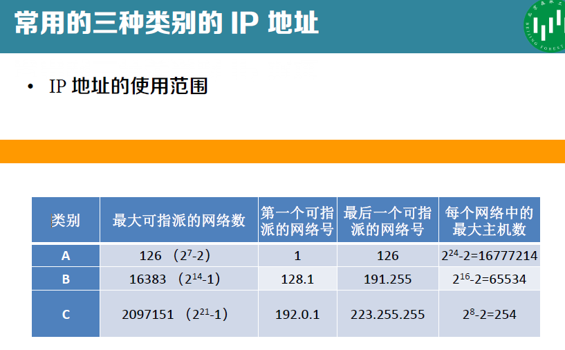

[toc]

crc手算

# 性能指标

- - 时延=传输时延（发送时延）+传播时延+处理时延
  - 发送时延 = $\frac{数据块长度L}{信道带宽R}$
  - 传播时延=$\frac{信道长度D}{电磁波在信道的传播速率V}$

## OSI参考模型

**请注意， OSI 模型本身并不是网络体系结构 ，因为它并没有定义每一层的服务和所用的协议， OSI 模型的意义在于指明了每层应该做些什么事 。**

## TCP/IP协议

1. 物理层：负责将 比特 从一个 节点 传送到下一个 节点
2. 数据链路层：负责将 帧 从一个 节点 传送到下一个 节点
3. 网络层：负责将来 分组 从 信源 送到 信宿 （目的地
4. 传输层：负责将 报文 从一个 进程 传送到另一个 进程
5. 应用层：负责 向用户 提供服务

# 概念重点

02 p84 等 网线规格

## 数据链路层

### 介质访问控制

协议 的 性能指标

- 低负载下的延迟
- 高负载下的信道利用率

竞争的协议在 负载较轻的情况下更加理想 ，因为延迟较短在高负载的情况下，竞争的协议在信道仲裁中所需要的开销越来越大，信道利用率就会随之下降。

无竞争协议在低负载情况下有较高的延迟，而在 高负载时，由于开销是固定的，信道的利用率会更具有优势 。

#### 竞争策略

##### ALOHA

发送站：	有数据需要发送时，就直接传输。
中央计算机站：广播其接收到的数据。
					没有冲突，发送站收到广播数据，确认其发送成功。
					有冲突，发送站等待随机一段时间，再次发送。

##### CSMA

载波侦听：发送站在发送数据前 先侦听信道，判断是否有他站发送了数据 ，依据侦听结果调整行为减少冲突。

依据 侦听到信道冲突后，处理方式的 不同可分为

- 坚持 CSMA
  信道空闲，发送数据；信道忙，不发送数据，并 坚持侦听信道，一旦侦听到 信道空闲，它 就 一定 发送数据 。

- 非坚持 CSMA
  信道空闲， 就 发送数据； 信道忙， 并不坚持侦听 ，而是等待一段随机时间，再重复 侦听。

- p-坚持 CSMA
  坚持侦听信道，一旦侦听到 信道空闲 ，以概率 p 发送数据，以 概率 1 p 不发送数据。

  

##### CSMA/CD
带 冲突检测 的 CSMA

冲突检测：当站 检测到它所接收到的信号比它发送的信号强时 ，就认为发生了冲突。

##### 二进制指数后退的 CSMA/CD

载波监听 ”即“先听再发, 先监听信道上传播的信号, 等信道空闲再发送数据

***<u>问题：传播时延对其影响 03 p43</u>***

**冲突检测( CD )**

每次冲突，最多持续占用信道 2 $\tau$ 时间

**退避重传**

检测到冲突停止发送数据后，要推迟（称为 退避r 倍 的 单位退避时间 后 再监听信道 进行重传（ r 为随机的整数）。单位退避时间 要尽可能小，但要保证两站点选择不同的 r 值时，一定不会再发生冲突。

​		*<u>单位退避时间的选择</u>*：至少$2\tau$，又称争用期；推迟$2k\tau$后再监听信道重传

****

CSMA/CD不适用于广域网，因为时延太大，争用期大，碰撞概率大，性能低。

#### 无竞争策略

##### 位图协议

基本位图法 basic bitmap method ）。基本位图法中每个竞争期包含 N 个时间槽 ，分别对应 N 个站。如果 1 号站有一帧数据要发送，则它在第 1 个槽中传送 1 位。一般地， j 号站通过在 j 号槽中插入 1 位来申明自己有数据需要发送。 当所有 N 个槽都经过后 ，每个站都知道了哪些站希望发送数据。这时候它们便按照数字顺序开始传送数据了 。

位图协议**信道利用率**
– 在低负载情况下， 每一帧 的额外开销为 N 位 ，若数据长度为d 位 ，则信道利用率为 d/( d+N 。在高负载情况下，若所有站都有数据需要发送，则 N 为竞争期被分摊到 N 个帧上，因此，每一帧的额外开销只有 1 位，信道利用率则为 d/(d+1) 。

##### 令牌传递

03 p58

##### 二进制倒计数

03 p59

**利用率**为 $d/(d+\log_2N)$  

#### 有限竞争

有限竞争协议（ limited contention protocol 在 低负载 下采用 竞争的做法 而提供 较短的延迟 在 高负载 下采用 无冲突技术 ，从而获得 良好的 信道 效率 。

有限竞争协议的基本思路是 首先将所有的站划分成组，组内 每个站 之间执行 竞争 策略 ，而 每个 组 之间 执行的是 无冲突协议 ，即每个组 对应一个时间槽。

当 负载较低 时，每个时间槽中的 站点数就多一些 。当 负载较高 时，每个时间槽中的 站点数目就少一些 ，通过动态地将站优化分配到每个时间槽，尽可能保证高效率和低延时。

### 802.11的MAC协议

**无线局域网不能简单地搬用 CSMA/CD 协议**。这里主要有两个原因。

- 对于无线信道，接收信号强度往往会远远小于发送信号强度。**无线信道难以实现碰撞检测 。**
- 对于无线信道，信号会向各个方向传播，并且传播距离受限，这就带来两个特殊问题： **隐蔽站问题 和 暴露站问题** 。
- 05 p7

#### 增加点协调层。

#### 载波侦听 碰撞避免CSMA/CA 协议。

##### 帧间间隔

##### 虚拟载波侦听

##### 确认机制

##### 信道可预约（可选）

## TCP/IP

### IP 协议

#### IP 地址

- 分类编址
  这是最基本的编址方法，在 1981 年就通过了相应的标准协议。
  05 p55
  
  

- 划分子网编址
  这是对最基本的编址方法的改进，其标准 RFC950 在 1985年通过。分类编址方式表面上看起来非常合理 但实际上仍有缺陷:

  - IP 地址空间的利用率有时很低 。
  - 两级的 IP 地址不够灵活 。
  - 给每一个物理网络分配一个网络号会使路由表变得太大因而使网络性能变坏 。

  从 1985 年起在 IP 地址中又增加了一个“子网号字段”，使两级的 IP 地址变成为 **三级的** IP 地址 。划分子网纯属一个单位内部的事情 。

  单位 对外 仍然表现为没有划分子网的网络 。 从主机号 借用 若干个位作为 子网号 subnet id，而主机号 host id 也就相应减少了若干个位 。
  计算网络地址的方法是将 地址掩码 与 IP 地址逐位AND，就得到了 子网的网络地址 。

- 无分类编址
  这是目前因特网所使用的编址方法。 1993 年提出后很快就得到推广应用。
  无分类域间路由选择 CIDRCIDR 使 IP 地址从三级编址（使用子网掩码）又回到了两级编址，但这已是无分类的两级编址。

#### IP 数据报

数据报分片 06 p16

### ARP/RARP 协议

- 发送方是 主机 ，要把 IP 数据报发送到本网络上的另一个主机。这时用 ARP 找到 目的主机的硬件地址 。
- 发送方是 路由器 ，要把 IP 数据报转发到本网络上的一个主机。这时用 ARP 找到 目的主机的硬件地址 。
- 发送方是 主机 ，要把 IP 数据报发送到另一个网络上的一个主机。这时用 ARP 找到本网络上的 一个路由器的硬件地址 。剩下的工作由这个路由器来完成。
- 发送方是 路由器 ，要把 IP 数据报转发到另一个网络上的一个主机。这时用 ARP 找到本网络上的 一个路由器的硬件地址 。剩下的工作由这个路由器来完成。

ARP 是解决 同一个局域网 上的主机或路由器的 IP 地址和硬件地址的映射问题 。

如果所要找的主机和源主机不在同一个局域网 上 那么就要通过 ARP 找到一个位于本局域网上的某个路由器的硬件地址 然后把分组发送给这个路由器 让这个路由器把分组转发给下一个网络 。 剩下的工作就由下一个网络来做。

### ICMP 协议

PING 使用了 ICMP 回送请求与回送回答报文 。

PING 是 应用层 直接使用 网络层 ICMP 的例子。它没有通过运输层的 TCP 或 UDP 。

### 路由选择协议

#### RIP 协议

#### OSPF 协议

### 路由器工作原理

### IPv6

# 题

## 码距 检错 纠错

书 p37

## CRC计算

## 码分复用

02 p38

## 报文交换 分组交换 时延

02 p58

## IP

### 判断IP

05 p67

### 计算地址块地址数

 

### 地址块划分

