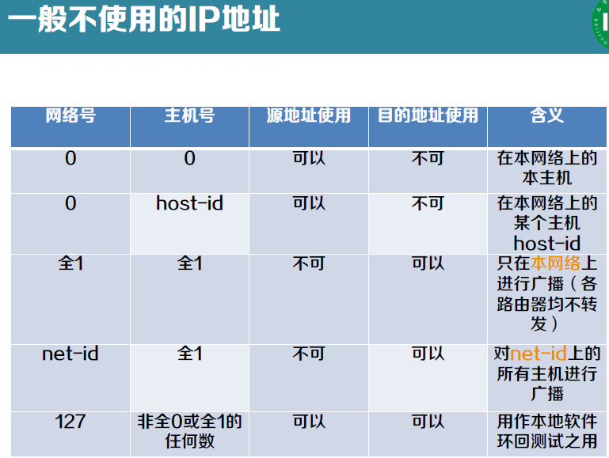

[toc]

crc手算

# 性能指标

- - 时延=传输时延（发送时延）+传播时延+处理时延
  - 发送时延 = $\frac{数据块长度L}{信道带宽R}$
  - 传播时延=$\frac{信道长度D}{电磁波在信道的传播速率V}$

## OSI参考模型

**请注意， OSI 模型本身并不是网络体系结构 ，因为它并没有定义每一层的服务和所用的协议， OSI 模型的意义在于指明了每层应该做些什么事 。**

## TCP/IP协议

1. 物理层：负责将 比特 从一个 节点 传送到下一个 节点
2. 数据链路层：负责将 帧 从一个 节点 传送到下一个 节点
3. 网络层：负责将来 分组 从 信源 送到 信宿 （目的地
4. 传输层：负责将 报文 从一个 进程 传送到另一个 进程
5. 应用层：负责 向用户 提供服务

# 概念重点

~~02 p84 等 网线规格~~

双绞线：当两根线绞在一起后，不同电线产生的干扰波会相互抵消从而能显著降低电线的辐射，这样**能量损耗越少，传输的距离也就越远**。信号通常以两根线的电压差来承载，这样可以有效**降低外部噪声的干扰** 。

## 数据链路层

数据链路层主要任务

- **介质访问控制** ：当两台或者两台以上设备连接到同一个链路时，需要 数据链路层 决定 哪台设备 在 什么时间 具有控制权。
- **分帧和寻址** ：数据链路层将接收自 网络层 的 分组 划分成便于管理的数据单元，称为 帧 。数据链路层会给帧加上 首部head ），定义该帧的发送方或接收方 。
- **差错控制** ：通过加入 检测 和 重传 机制，提高可靠性。通常是通过给帧增加 尾部 来实现的。

### 介质访问控制

协议 的 性能指标

- 低负载下的延迟
- 高负载下的信道利用率

竞争的协议在 负载较轻的情况下更加理想 ，因为延迟较短在高负载的情况下，竞争的协议在信道仲裁中所需要的开销越来越大，信道利用率就会随之下降。

无竞争协议在低负载情况下有较高的延迟，而在 高负载时，由于开销是固定的，信道的利用率会更具有优势 。

#### 竞争策略

##### ALOHA

发送站：	有数据需要发送时，就直接传输。
中央计算机站：广播其接收到的数据。
					没有冲突，发送站收到广播数据，确认其发送成功。
					有冲突，发送站等待随机一段时间，再次发送。

##### CSMA

载波侦听：发送站在发送数据前 先侦听信道，判断是否有他站发送了数据 ，依据侦听结果调整行为减少冲突。

依据侦听到**信道冲突**后，处理方式的 不同可分为

- 1 - 坚持 CSMA
  信道空闲，发送数据；信道忙，不发送数据，并 坚持侦听信道，一旦侦听到 信道空闲，它 就 一定 发送数据 。

- 非坚持 CSMA
  信道空闲， 就 发送数据； 信道忙， 并不坚持侦听 ，而是等待一段随机时间，再重复 侦听。

- p - 坚持 CSMA
  坚持侦听信道，一旦侦听到 信道空闲 ，以概率 p 发送数据，以 概率 1-p 不发送数据。

  

##### CSMA/CD

带 冲突检测 的 CSMA

冲突检测：当站 检测到它所接收到的信号比它发送的信号强时 ，就认为发生了冲突。

##### 二进制指数后退的 CSMA/CD

载波监听 ”即“先听再发, 先监听信道上传播的信号, 等信道空闲再发送数据

***<u>问题：传播时延对其影响 03 p43</u>***

**冲突检测( CD )**

每次冲突，最多持续占用信道 2 $\tau$ 时间

**退避重传**

检测到冲突停止发送数据后，要推迟（称为 退避r 倍 的 单位退避时间 后 再监听信道 进行重传（ r 为随机的整数）。单位退避时间 要尽可能小，但要保证两站点选择不同的 r 值时，一定不会再发生冲突。

​		*<u>单位退避时间的选择</u>*：至少$2\tau$，又称争用期；推迟$2k\tau$后再监听信道重传

CSMA/CD不适用于广域网，因为时延太大，争用期大，碰撞概率大，性能低。

#### 无竞争策略

##### 位图协议

基本位图法中每个竞争期包含 N 个时间槽 ，分别对应 N 个站。

位图协议**信道利用率**
– 在低负载情况下， 每一帧 的额外开销为 N 位 ，若数据长度为d 位 ，则信道利用率为 d/( d+N 。在高负载情况下，若所有站都有数据需要发送，则 N 为竞争期被分摊到 N 个帧上，因此，每一帧的额外开销只有 1 位，信道利用率则为 d/(d+1) 。

##### 令牌传递

03 p58

令牌传递的性能类似于位图协议 ，但是 因为周期内所有位置是均等的 ，所以不存在偏向低编号或者高编号

##### 二进制倒计数

03 p59

**利用率**为 $d/(d+\log_2N)$  

#### 有限竞争

有限竞争协议（ limited contention protocol 在 低负载 下采用 竞争的做法 而提供 较短的延迟 在 高负载 下采用 无冲突技术 ，从而获得 良好的 信道 效率 。

有限竞争协议的基本思路是 首先将所有的站划分成组，组内 每个站 之间执行 竞争 策略 ，而 每个 组 之间 执行的是 无冲突协议 ，即每个组 对应一个时间槽。

当 负载较低 时，每个时间槽中的 站点数就多一些 。当 负载较高 时，每个时间槽中的 站点数目就少一些 ，通过动态地将站优化分配到每个时间槽，尽可能保证高效率和低延时。

### MAC帧

**最常用的 MAC 帧 是 以太网 V2 的格式。**

站的源地址具有 全球唯一性 。 即 每个站具有一个唯一的标识，也称为 MAC 地址 。

- **地址字段**
    - 前三个字节 由 IEEE 的注册管理机构负责分配。该地址块的正式名称是 组织统一标识符 Organizationally UniqueIdentifier OUI ），通常也叫做公司标识符company id ）。
    - 地址的 后三个字节 由生产厂家自行指派，称为 扩展标识符Extended Unique Identifier ）。
    - 由于生产网络 设备 时，这 6 个字节的 MAC 地址已经被 固化了，因此 MAC 地址也被称为 硬件地址 或者 物理地址 。
    - 如果目标地址的 第一位是 0 ，则表示这是一个 普通地址。如果是 1 ，则表示这是一个 组地址 。组地址允许多个站同时监听一个地址。当某个帧被发送到一个组地址， 该组中所有站都要接收它 。这种一组地址的发送行为称为 组播multicasting 。
    - 由 全 1 组成的特殊地址保留作为 广播（ broadcasting 。如果一个帧的目标地址字段为全 1 ，则它被网络上的 所有站接收。
- **类型字段**：用来标志上一层 使用的是什么协议，以便把收到的 MAC 帧的数据上交给上一层的这个协议 。
- **数据字段**：46 ~ 1500 字节。数据字段的长度小于 46 字节时，应在数据字段的后面加入整数字节的填充字段，以保证以太网的<u>**MAC 帧长不小于 64 字节**</u>。

以太网的**<u>MAC 帧长不小于 64 字节，小于1518字节</u>**。

- 数据字段长度
    - 数据长度的**上界** 是由于当时网络设备的 **RAM限制**而决定的。
    - 数据长度的**下界** 长度的设计考虑了两个因素。
        - 首先，是为了**区别 有效帧 和 垃圾数据** 。当 **收发器检测到冲突** 时，它会截断当前的帧，这意味着冲突帧中已经发送的位将出现在广播信道上。但由于这些被截断的数据长度小于正常帧，所以可利用长度来判断是有效帧还是垃圾数据。
        - 其次，为了 保证**所有站点 在 发送完一个帧之前能够检测出该帧是否发生了碰撞** 。
        - 

### 802.11的MAC协议

**无线局域网不能简单地搬用 CSMA/CD 协议**。这里主要有两个原因。

- 对于无线信道，接收信号强度往往会远远小于发送信号强度。**无线信道难以实现碰撞检测 。**
- 对于无线信道，信号会向各个方向传播，并且传播距离受限，这就带来两个特殊问题： **隐蔽站问题 和 暴露站问题** 。
- 05 p7

#### 增加点协调层。

#### 载波侦听 碰撞避免CSMA/CA 协议。

##### 帧间间隔

##### 虚拟载波侦听

##### 确认机制

##### 信道可预约（可选）

## 局域网

### 共享式以太网

### 交换式以太网

**交换机**

- 集线器只是在电气上简单地连接所有连接线，就像把它们焊接在一起，不能增加容量，因为它们逻辑上等同于单根电缆的经典以太网 。
- 随着越来越多的站加入，每个站获得的固定容量共享份额下降 。 为了处理不断增长的负载 出现了 以 交换机 为核心的 交换式以太网 。
- 
    - 优势：通过 电缆把交换机或者集线器与一台计算机连接。通过简单的插入或者拔出电缆就能完成增加或者删除一台机器，并且由于片状电缆或者端口通常只影响到一台机器，因此大多数错误都很容易被发现。
    - 缺点：如果集线器或者 交换机本身 发生 的故障 ，则所 有站都 会 失去网络连接 。

**冲突域不同**

- 在集线器中，所有站都位于同一个冲突域（ collisiondomain ），它们必须使用 CSMA /CD 算法来调度各自的传输。
- 在交换机中，每个端口有自己独立的冲突域。通常情况下，电缆是全双工的，站和端口可以同时往电缆上发送帧，根本无须担心其他站或者端口。因为不会发生冲突，因而也就不需要用CSMA /CD 。如果电缆是半双工的，则站和端口必须以通常的 CSMA /CD 方式竞争传输。

**带宽**

- 对于普通 10 Mb/s 的共享式以太网，若共有 N 个用户，则每个用户占有的平均带宽只有总带宽的 N 分之一 。
- 使用以太网交换机时，虽然在每个接口到主机的带宽还是10 Mb/s ，但由于一个用户在通信时是 独占 而不是和其他网络用户共享传输媒体的带宽，因此对于拥有 N 对接口的交换机的总容量为 N 10 Mb/s 。

#### **快速以太网**

保持 **以太网的接口**、**帧格式** 和 **过程规则** 不变，但是传输速率升级为 100Mbps ，哪些必须要变呢

- 保持最小帧长仍为 64byte ，传输速率升级为 100Mbps

- 争用期变为 5.12 𝜇𝑠

- 网段最大电缆长度减少至原数据的十分之一，约 100m

    **全双工方式不用CSMA/CD**
    **半双工方式时要使用CSMA/CD**

    

    #### 千兆以太网

    

    

    

## TCP/IP

### IP 协议

#### IP 地址

- 分类编址
  这是最基本的编址方法，在 1981 年就通过了相应的标准协议。
  05 p55
  
  

- 划分子网编址
  这是对最基本的编址方法的改进，其标准 RFC950 在 1985年通过。分类编址方式表面上看起来非常合理 但实际上仍有缺陷:

  - IP 地址空间的利用率有时很低 。
  - 两级的 IP 地址不够灵活 。
  - 给每一个物理网络分配一个网络号会使路由表变得太大因而使网络性能变坏 。

  从 1985 年起在 IP 地址中又增加了一个“子网号字段”，使两级的 IP 地址变成为 **三级的** IP 地址 。划分子网纯属一个单位内部的事情 。

  单位 对外 仍然表现为没有划分子网的网络 。 从主机号 借用 若干个位作为 子网号 subnet id，而主机号 host id 也就相应减少了若干个位 。
  计算网络地址的方法是将 地址掩码 与 IP 地址逐位AND，就得到了 子网的网络地址 。

- 无分类编址
  这是目前因特网所使用的编址方法。 1993 年提出后很快就得到推广应用。
  无分类域间路由选择 CIDRCIDR 使 IP 地址从三级编址（使用子网掩码）又回到了两级编址，但这已是无分类的两级编址。

#### IP 数据报

数据报分片 06 p16

### ARP/RARP 协议

- 发送方是 主机 ，要把 IP 数据报发送到本网络上的另一个主机。这时用 ARP 找到 目的主机的硬件地址 。
- 发送方是 路由器 ，要把 IP 数据报转发到本网络上的一个主机。这时用 ARP 找到 目的主机的硬件地址 。
- 发送方是 主机 ，要把 IP 数据报发送到另一个网络上的一个主机。这时用 ARP 找到本网络上的 一个路由器的硬件地址 。剩下的工作由这个路由器来完成。
- 发送方是 路由器 ，要把 IP 数据报转发到另一个网络上的一个主机。这时用 ARP 找到本网络上的 一个路由器的硬件地址 。剩下的工作由这个路由器来完成。

ARP 是解决 同一个局域网 上的主机或路由器的 IP 地址和硬件地址的映射问题 。

如果所要找的主机和源主机不在同一个局域网 上 那么就要通过 ARP 找到一个位于本局域网上的某个路由器的硬件地址 然后把分组发送给这个路由器 让这个路由器把分组转发给下一个网络 。 剩下的工作就由下一个网络来做。

### ICMP 协议

PING 使用了 ICMP 回送请求与回送回答报文 。

PING 是 应用层 直接使用 网络层 ICMP 的例子。它没有通过运输层的 TCP 或 UDP 。

### 路由选择协议

#### RIP 协议

#### OSPF 协议

### 路由器工作原理

### IPv6

# 题

### 数据交换

- 概念

    - **电路交换**：是在用户开始通信前，先申请建立一个 从发送端 到 接收端 的物理信道，并且 在双方通信期间始终占用该信道 。

    - **报文交换**：是以 报文 为数据交换的单位，报文携带有 目标地址、源地址等信息，在交换结点 对 报文整体 采用 存储转发 的方式进行传输。报文是 发送信息整体 ，例如 一个文件 ，长度不受限制。
    - **分组交换**：将一个 长报文 先分割为若干个较短的 分组，然后仍采用 存储转发 传输方式，把这些分组逐个发送出去。分组又称为“包”，在每一个分组前面，包含一些必要的制信息组成的 首部。分组的首部也称为“包头”。

- 对比

    - **电路交换**： 整个报文 的比特流 连续地从源点直达终点
    - **报文交换**： 整个报文 先传送到相邻结点，全部 存储 下来后查找 转发 表，转发到下一个结点
    - **分组交换**： 单个分组 （整个报文的一部分）传送到相邻结点存储 下来后查找转发，转发到下一个结点。

- 优缺点

    - 要 连续传送大量的数据 ，且其传送时间 远大于 连接建立时间，则 电路交换 具有传输速率较快的优点。
    - 报文交换和分组交换不需要预先分配传输带宽，在 传送突发数据 时可提高整个网络的信道利用率。分组交换比报文交换的时延小，但其结点交换机必须具有更强的处理能力。

# 计算题

## 码距 检错 纠错

书 p37

## CRC计算

## 码分复用

02 p38

## 报文交换 分组交换 时延

02 p58

## IP

### 判断IP

05 p67

### 计算地址块地址数

 

### 地址块划分

