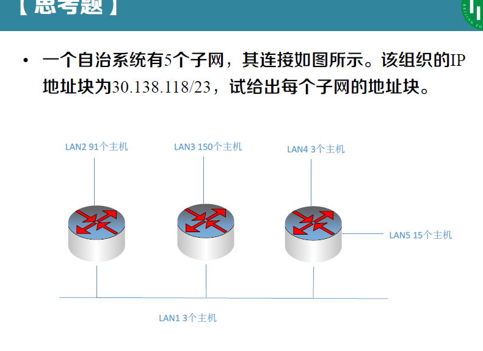

- [ ] 冲突检测：当站检测到它所接收到的信号比它发送的信号强时 ，就认为发生了冲突。**<u>怎么强？</u>**

- [ ] 03 p47   $2\tau$ 为什么？03 p48  为什么要$2\tau$整数倍？$\tau$不行吗？

- [ ] 当然，这两个主机号是全0 和全 1 的地址一般并不使用。

- [ ] ~~无分级，同一ip不同掩码，是否一样？~~

- [ ] ~~子网划分 总需求占不满怎么办~~

  

- [ ] 数据报分片？长度？

- [ ] 会有步骤默写吗？例如ip数据包转发流程

以太网数据包最短多少？

